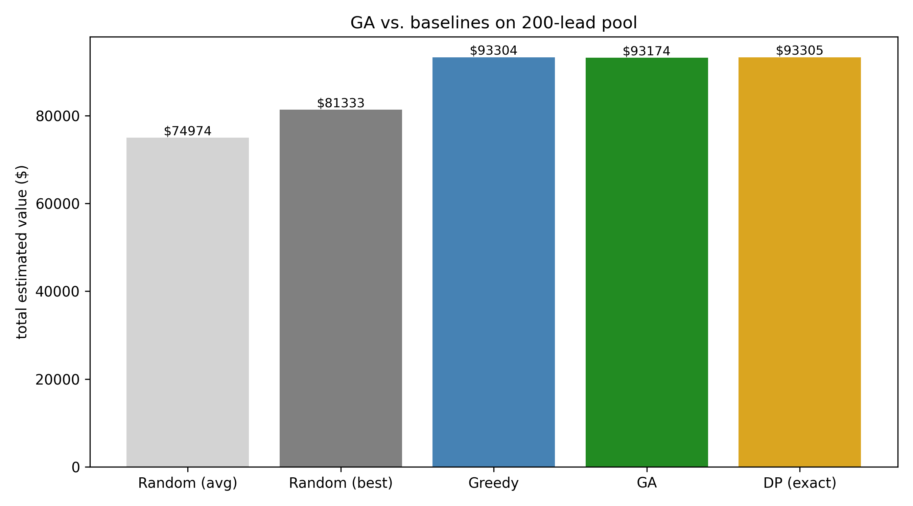
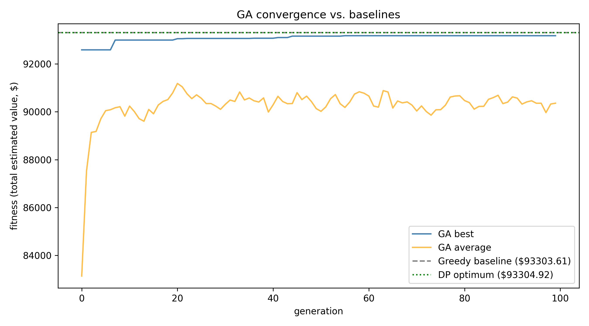
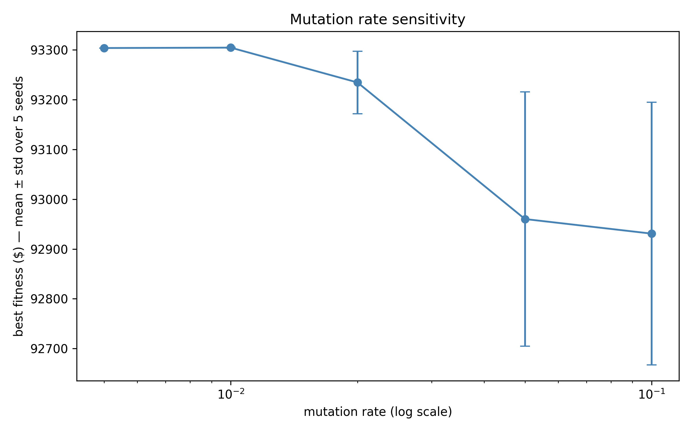
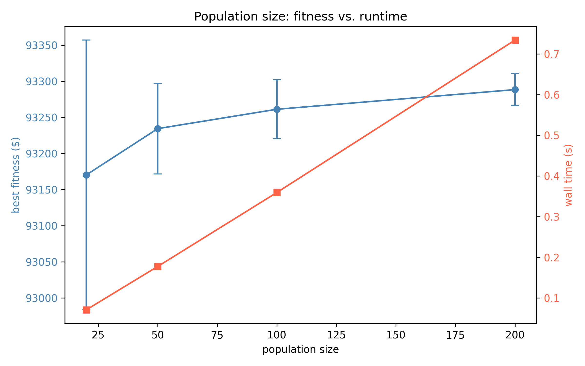
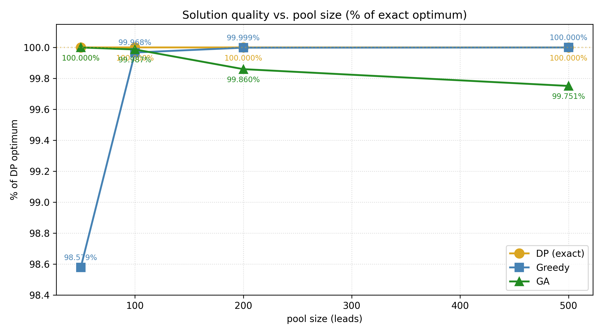
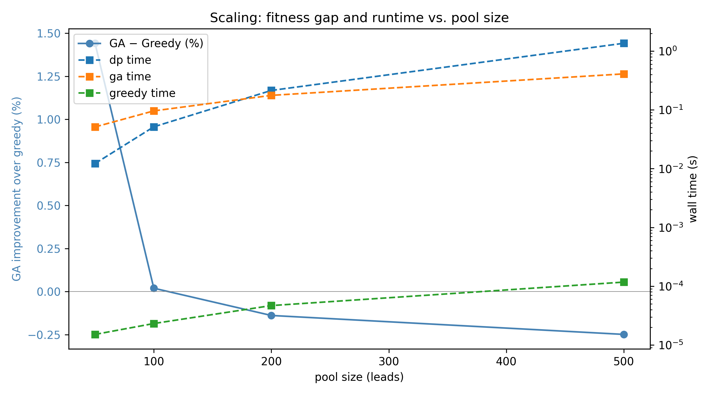
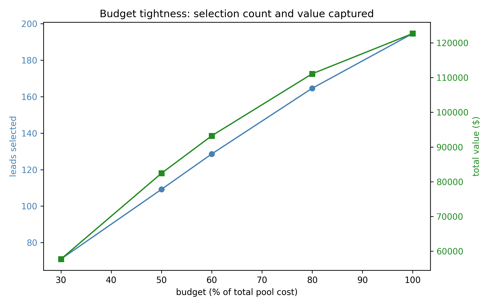
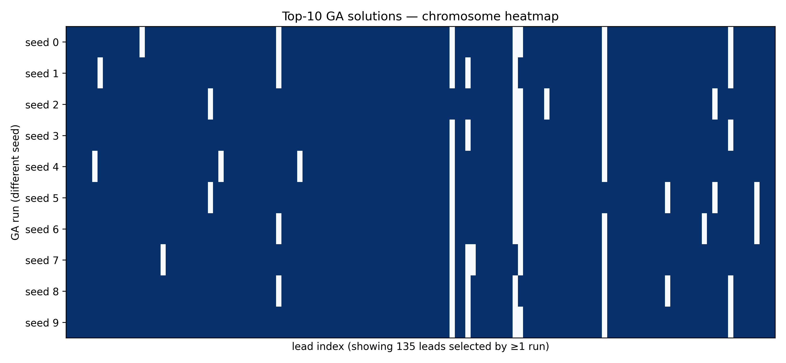

# Enrichment Budget Optimizer: A Genetic Algorithm for Lead Allocation

**Author:** Enrique Perezalonso
**Course:** IFSA CS38-09, Introduction to Artificial Intelligence
**Date:** April 2026

---

## 1. The Problem

Helios Marketing is building an AI Sales Development Representative (SDR) called Hermes. Every day, Hermes scrapes new business leads from the Google Places API (small real-estate brokerages, insurance agencies, and finance firms in Florida), "enriches" each one by running a Gemini Flash LLM over the lead's website to extract an owner name and email address, and then sends a personalized cold email. The goal is to book meetings.

The most expensive step in this pipeline is enrichment. Each Gemini call costs about **$0.002**, and roughly **30% of leads "die"** during enrichment because no decision-maker email can be found. That money is wasted. With a tight daily budget, we cannot afford to enrich every lead we prospect, so some selection policy is required.

The current production system enriches leads in the order they were scraped (FIFO), up to a fixed per-tick cap. This is a weak policy. There is no reason to believe the first lead in the queue is the best one to spend money on. A 60-employee brokerage with a 4.5-star rating and 100 Google reviews is almost certainly worth more than a 5-employee office with no website, yet Hermes currently treats them identically.

The question this project addresses is:

> **Given a pool of N un-enriched leads, each with an estimated value $v_i$ and an enrichment cost $c_i$, and a fixed daily budget $B$, which subset should we enrich to maximize total expected value?**

This is a textbook optimization problem with a well-known name.

---

## 2. The Knapsack Problem

The formal name for this problem is the **0/1 knapsack problem**. The classic story: you are a thief with a knapsack that can hold at most $B$ pounds of loot. A shop contains $N$ items. Item $i$ weighs $c_i$ pounds and is worth $v_i$ dollars. Each item is taken entirely ($x_i = 1$) or left behind ($x_i = 0$); fractional items are not allowed. The objective is to select items that maximize total value without exceeding the knapsack's capacity.

Expressed formally:

$$
\text{maximize } \sum_{i=1}^{N} v_i x_i \quad \text{subject to } \sum_{i=1}^{N} c_i x_i \le B, \quad x_i \in \{0, 1\}.
$$

The mapping from knapsack to the enrichment problem is exact:

| Knapsack | Enrichment optimizer |
|---|---|
| Item | A prospected lead |
| Weight $c_i$ | Enrichment cost in dollars |
| Value $v_i$ | Estimated expected value (deal size × reply probability) |
| Capacity $B$ | Daily enrichment budget |
| $x_i \in \{0,1\}$ | Enrich this lead or skip it |

### 2.1 Why this problem is hard

Knapsack looks simple. You just want to pack the most valuable items that fit. Solving it exactly in general, however, is not easy. Richard Karp proved 0/1 knapsack is **NP-complete** in his 1972 paper "Reducibility Among Combinatorial Problems," as one of the original 21 problems he established as NP-complete by polynomial-time reductions. In practice this means that no algorithm is known to solve arbitrary instances in polynomial time. For $N$ items there are $2^N$ possible subsets. On the 200-lead pool used in this project, that amounts to $2^{200} \approx 1.6 \times 10^{60}$ possibilities, which is more than the estimated number of atoms in the observable universe. Brute-force enumeration is therefore out of reach.

There are two standard ways around this:

1. **Dynamic programming (DP).** When the weights are integers, knapsack is solvable exactly in $O(N \cdot B)$ time by building a table that answers "what is the best value achievable using the first $i$ items with capacity $w$?" for every $(i, w)$ pair. This is a pseudo-polynomial algorithm: polynomial in $N$ and the numeric value of $B$, but exponential in the number of bits needed to represent $B$. It works well when $B$ is small and breaks down when $B$ is large.
2. **Heuristics.** Give up on exactness and aim for a "pretty good" answer quickly. The simplest heuristic is the **greedy** algorithm: sort items by value-per-dollar ($v_i / c_i$) and fill the knapsack top-down. It is fast and often close to optimal, but there exist instances on which it is arbitrarily bad.

For this project I implemented both DP and greedy as baselines, and then built the main attraction, a **genetic algorithm**.

### 2.2 Why a genetic algorithm

A genetic algorithm (GA) is a stochastic search method inspired by biological evolution: maintain a population of candidate solutions, let the fitter ones "breed" to produce offspring, occasionally mutate them, and repeat until they converge. I chose a GA for three reasons:

- **The course treats AI search this way.** GAs fall under the "local search" family of AI search algorithms covered in class, and the assignment explicitly required a GA project.
- **Knapsack has a natural binary encoding.** Each chromosome is simply a list of 0s and 1s, one per lead, indicating "enrich" or "skip." Standard GA operators (crossover, mutation) are trivial to implement on this representation.
- **I wanted to compare against DP.** Since DP provides the true optimum, I can measure exactly how close the GA gets. This kind of ground-truth comparison is uncommon in AI projects and makes the empirical claims far more credible.

---

## 3. PEAS Analysis

The standard way to describe an AI task environment is the **PEAS** framework: Performance, Environment, Actuators, and Sensors. Here is the PEAS for the enrichment optimizer.

| Dimension | Description |
|---|---|
| **Performance** | Maximize total expected value of enriched leads while staying under the daily budget. Secondary measures include how much of the budget was actually spent and how many leads were selected. |
| **Environment** | A pool of $N$ leads. Each lead has Google Places features (rating, review count, website presence, phone, business type) and derived numbers (estimated enrichment cost, estimated value). |
| **Actuators** | One action per lead: enrich ($x_i = 1$) or skip ($x_i = 0$). |
| **Sensors** | Google Places API responses and Hermes's internal enrichment cost model. |

### 3.1 Environment properties

Task environments are conventionally classified along six dimensions. The enrichment allocation problem falls in the "easy" cell of each one:

- **Fully observable.** Every lead's features and the budget are known at decision time. Nothing is hidden.
- **Deterministic.** Given the same pool and budget, the optimal subset is fixed. The reply outcomes for each lead are stochastic in reality, but the *expected* value is deterministic, and the optimizer works on the expectation.
- **Episodic.** Each day's decision is independent. Today's choice does not constrain tomorrow's.
- **Static.** The pool does not change during the decision. There is as much time as needed.
- **Discrete.** The action space is $\{0, 1\}^N$, with no continuous knobs.
- **Single-agent.** There is no adversary.

Each of these properties makes the problem substantially easier than a real-world AI task such as autonomous driving (partially observable, stochastic, sequential, dynamic, continuous, multi-agent). That simplicity is precisely what enables the use of offline optimization.

### 3.2 Agent type

Before this project, Hermes was a **simple reflex agent** for enrichment: a single rule, "if a lead has status `new`, queue it." It does not reason about which lead is better.

After this project, Hermes becomes a **utility-based agent** for enrichment: it assigns each lead a utility (expected value), computes a budget-constrained allocation that maximizes total utility, and acts on that allocation. This is the main jump on the standard agent hierarchy from rules to utilities. It is also the conceptual point of the class project. The contribution is not only a knapsack solver; it is an upgrade in the agent type of a production system.

---

## 4. Estimating Lead Value

Before any optimizer can select leads, there must be a number to optimize. The knapsack formulation takes the estimated value $v_i$ as an input, but how that number is produced is a modeling choice that drives the entire project. A bad value model produces the optimal allocation for the wrong objective. This section documents how $v_i$ and $c_i$ are computed in the synthetic generator (`generate.py`), which is calibrated against Hermes's real pricing and real observed feature distributions.

### 4.1 Expected value

The estimated value of a lead is its expected revenue from being enriched and contacted:

$$
v_i = \text{deal\_size}_i \times P(\text{reply}_i).
$$

The deal size follows Hermes's actual contract tiers. Helios quotes clients based on company size: firms with 50 or more employees are priced at $5,000 per deal, while smaller firms are priced at $3,000. So the deal size is a step function of `estimated_employees`, not a smooth one:

$$
\text{deal\_size}_i = \begin{cases} \$5{,}000 & \text{if } \text{employees}_i \ge 50 \\ \$3{,}000 & \text{otherwise.} \end{cases}
$$

The reply probability is a logistic function of the lead's observable features. I fit hand-tuned coefficients (rather than learning them) because Hermes does not yet have enough closed deals to train a real model. The coefficients were chosen so that the resulting distribution of reply probabilities roughly matches what I observe in Hermes's actual reply rates (mostly in the 5 to 40% range, with a mean around 18%):

$$
P(\text{reply}_i) = \sigma\big(z_i\big), \quad z_i = -2.5 + 0.6 \tfrac{\text{rating}_i}{5} + 0.3 \tfrac{\log(1 + \text{reviews}_i)}{6} + 0.4 \cdot \text{has\_website}_i + 0.2 \cdot \text{is\_real\_estate}_i + \varepsilon_i
$$

where $\sigma(z) = 1/(1 + e^{-z})$ is the sigmoid function and $\varepsilon_i \sim \mathcal{N}(0, 0.3)$ is a per-lead noise term that represents the irreducible uncertainty in any lead's reply behavior.

Each coefficient encodes a prior about which Google Places signals predict reply probability:

| Feature | Coefficient | Intuition |
|---|---:|---|
| Google rating (scaled to 0-1) | +0.6 | Higher-rated firms are more established; their owners read email. |
| log(1 + reviews) (scaled) | +0.3 | Review count proxies for customer volume and online engagement. |
| Has a website | +0.4 | Firms without a website are often dormant or lifestyle businesses. |
| Is a real-estate agency | +0.2 | Hermes's messaging is tuned for real-estate SDR outreach. |
| Intercept | -2.5 | Sets the base reply rate to a realistic low level. |

### 4.2 Enrichment cost

The cost $c_i$ of enriching a single lead is a multiple of a $0.002 base (the average per-call price of Gemini Flash for a single website scrape). The multiplier depends on the lead's features:

$$
c_i = 0.002 \times \begin{cases} 0.5 & \text{if the lead has no website (fast failure, few tokens)} \\ 1.5 & \text{if the lead has more than 200 reviews (larger site, more tokens)} \\ 1.0 & \text{otherwise.} \end{cases}
$$

This structure reflects a real operational fact: leads without websites are cheap to rule out because the scrape fails immediately, while leads that are clearly large and well-documented (many reviews) cost more because Gemini has to process longer pages.

Two features (`has_website` and `google_reviews`) appear in both the numerator and the denominator of the value-to-cost ratio. This coupling is deliberate and realistic. A lead with no website is cheap to process but also less likely to reply, so its value-to-cost ratio can land anywhere; the optimizer has to resolve that trade-off.

### 4.3 Worked example

Two concrete leads illustrate what these formulas produce:

**Lead A.** A 60-employee real-estate brokerage in Miami, with a 4.5-star Google rating, 80 reviews, and a website.

- Deal size: $5,000 (because employees >= 50).
- Logit $z \approx -2.5 + 0.6(0.9) + 0.3 \cdot \log(81)/6 + 0.4 + 0.2 \approx -1.14$.
- Reply probability: $\sigma(-1.14) \approx 0.24$.
- Estimated value: $5{,}000 \times 0.24 = \$1{,}200$.
- Enrichment cost: $0.002 \times 1.0 = \$0.002$.
- Value-to-cost ratio: $600{,}000$.

**Lead B.** A 10-employee "other" business with a 3.8-star rating, 5 reviews, and no website.

- Deal size: $3,000 (employees < 50).
- Logit $z \approx -2.5 + 0.6(0.76) + 0.3 \cdot \log(6)/6 + 0 + 0 \approx -1.96$.
- Reply probability: $\sigma(-1.96) \approx 0.12$.
- Estimated value: $3{,}000 \times 0.12 = \$360$.
- Enrichment cost: $0.002 \times 0.5 = \$0.001$ (no-website discount).
- Value-to-cost ratio: $360{,}000$.

Even though Lead B is cheaper to enrich, Lead A is roughly 1.7 times more valuable per dollar. A greedy solver would select Lead A first.

### 4.4 Caveat: these coefficients are not learned

The coefficients above are hand-tuned priors, not parameters learned from data. This is a deliberate choice made because Hermes does not yet have enough closed deals to train a reliable reply-probability model (the companion `lead_scorer` project will take over that role once enough data exists). The optimizer does not care where $v_i$ comes from. When a trained model is ready, the `estimated_value` column in `leads_pool.csv` will be replaced with model predictions and the GA, greedy, and DP code all continue to work unchanged. This decoupling (feature engineering upstream, optimization downstream) is a central design property of the project.

---

## 5. Implementation

All three solvers live in `enrichment_optimizer/baselines.py` and `enrichment_optimizer/ga.py`. The implementation is pure Python plus NumPy; no GA or optimization libraries are used.

### 5.1 Greedy

The greedy solver (`baselines.py:greedy_knapsack`) is about 15 lines of code. It performs three steps:

1. Compute each lead's value-to-cost ratio, $r_i = v_i / c_i$.
2. Sort all leads by $r_i$ in descending order.
3. Walk down the sorted list; for each lead, if its cost still fits in the remaining budget, include it and subtract its cost from the remaining budget. Otherwise, skip it and continue.

The runtime is $O(N \log N)$, dominated by the sort. Greedy makes no backtracking decisions: once a lead is skipped, it is never revisited. This myopia is what makes greedy suboptimal in the worst case. For example, if the highest-ratio item uses up most of the budget, two slightly lower-ratio items that together would be more valuable may no longer fit.

### 5.2 Dynamic programming

The DP solver (`baselines.py:exact_dp_knapsack`) computes the exact optimum. Because knapsack is pseudo-polynomial in $B$, the implementation first scales all costs to integers. Enrichment costs are in the range $[\$0.001, \$0.003]$, so multiplying by $10^5$ preserves full resolution ($\$0.00001$ precision) while keeping all values integer. The budget is scaled by the same factor.

The DP fills a 2D table `dp[i][w]`, where entry $(i, w)$ holds the maximum value achievable using only the first $i$ leads, subject to capacity $w$. The recurrence is:

$$
dp[i][w] = \max \begin{cases} dp[i-1][w] & \text{(skip item } i\text{)} \\ dp[i-1][w - c_i] + v_i & \text{if } c_i \le w \text{ (take item } i\text{)} \end{cases}
$$

After the table is filled, the solver back-traces from $dp[N][B_{\text{scaled}}]$ to reconstruct which leads are selected: at each step, if $dp[i][w] \ne dp[i-1][w]$, lead $i$ is in the solution and the capacity decreases by $c_i$. The runtime and memory are both $O(N \cdot B_{\text{scaled}})$. For the default 200-lead pool, the table has about 4.2 million cells, and the solver runs in about 0.2 seconds. A safety guard aborts and returns `None` if the table would exceed 50 million cells, in which case the calling code falls back to greedy as the reference upper bound.

### 5.3 Genetic algorithm

Only the short version of the GA is presented here; the full code is about 180 lines in `ga.py`.

**Chromosome.** A list of 200 bits. Bit $i = 1$ means "enrich lead $i$."

**Fitness.** The sum of $v_i$ for all selected leads. If the chromosome is over budget, the fitness is multiplied by 0.01 as a heavy penalty. The penalty is heavy without being total extinction, which preserves some selection pressure on near-feasible individuals so that information from almost-good chromosomes is not completely discarded.

**One generation.**

1. Carry the top 2 chromosomes unchanged into the next generation (**elitism**, which guarantees the best-so-far solution is never lost).
2. Fill the rest of the new population by repeatedly performing:
   - **Tournament selection.** Sample 3 chromosomes uniformly at random and retain the fittest. Do this twice to produce two parents.
   - **Uniform crossover.** For each bit position independently, flip a fair coin to decide which parent's bit each child inherits. Apply this with probability 0.8; otherwise pass the parents through unchanged.
   - **Bit-flip mutation.** Each bit has a 2% probability of being flipped.
   - **Budget repair.** If the offspring is over budget, drop selected leads in order of ascending value-to-cost ratio until feasibility is restored.
3. Repeat for 100 generations. Return the best chromosome ever observed.

Defaults: population size 50, tournament size $k = 3$, crossover rate 0.8, mutation rate 0.02, elitism 2. These are standard GA defaults. The overall framing treats the GA as a form of stochastic hill-climbing over a population, which is the local-search view covered in class.

---

## 6. Results

All numbers and figures below were produced by `python -m enrichment_optimizer.optimize`, `experiments`, and `evaluate` on the default 200-lead pool with seed 42.

### 6.1 Main comparison

The headline result, on the 200-lead pool with $B = \$0.2142$ (60% of the total pool cost):

| Method | Value captured | % of the optimum |
|---|---:|---:|
| Random (average of 1000 trials) | $74,974 | 80.4% |
| Random (best of 1000) | $81,333 | 87.2% |
| Greedy (value/cost ratio) | $93,304 | 99.9998% |
| **Genetic algorithm** | **$93,174** | **99.86%** |
| DP (exact optimum) | $93,305 | 100.00% |

Two points are worth emphasizing. First, the GA reaches 99.86% of the exact optimum, which is the core claim of the project. Second, greedy is effectively tied with DP on this instance, which is a substantive empirical finding and is discussed further in Section 7.

### 6.2 GA convergence

The GA runs for 100 generations. Figure 2 shows how the best-fitness-so-far and the population-average fitness evolve across generations.

The blue line (best fitness) rises sharply in the first few generations and then plateaus near the DP optimum (green dotted) and the greedy baseline (gray dashed). The orange line (population average) is noisier and lower because mutation keeps perturbing non-elite members. The best-fitness curve is monotonically non-decreasing, as guaranteed by elitism. A unit test in `test_ga.py` enforces this property.

The warm start matters. 20% of the initial population is seeded from the greedy solution with a handful of random bit flips, so the GA begins its search from a known-good region rather than from pure noise. This is a large part of why convergence is so rapid.

### 6.3 Mutation rate: less is more

A natural hypothesis is that higher mutation rates would improve the result by increasing exploration. The data contradicts this.

Lower mutation rates hit the DP optimum on every seed, while higher ones lose hundreds of dollars of value. The reason is that the initial population is already near the optimum, thanks to the greedy seed. The GA's job is exploitation, not exploration, and high mutation destroys good solutions faster than it discovers new ones. If the initial population had been pure noise, the story would likely reverse.

### 6.4 Population size: more is better, at linear cost

Larger populations improve mean fitness but cost proportionally more wall-clock time.

Doubling the population roughly doubles runtime (each generation does twice the work) and improves mean best fitness by a small amount. The largest population (200) reaches the DP optimum on 2 of 5 seeds. This is the classic GA exploration/exploitation trade-off: more samples lead to more chances of stumbling on the exact optimum.

### 6.5 Scaling

The three methods were compared across pool sizes 50, 100, 200, and 500. Figure 5 plots each method's fitness as a percentage of the DP optimum. Plotting raw dollar values hides the comparison because all three methods land within 0.15% of each other at every scale, so the lines would stack on top of one another. The percent-of-optimum view keeps those small but real gaps visible. Figure 6 shows the complementary runtime and relative-gap view produced by the experiment script.

| Pool | Greedy | GA | DP | DP time |
|---:|---:|---:|---:|---:|
| 50 | $21,983 | **$22,300** | $22,300 | 0.01s |
| 100 | $47,848 | $47,857 | $47,863 | 0.05s |
| 200 | $93,304 | $93,174 | $93,305 | 0.21s |
| 500 | $233,548 | $232,968 | $233,548 | 1.36s |

Two observations stand out. At **N = 50**, the GA beats greedy by 1.4% and ties the DP optimum exactly. This is the regime where greedy's myopia actually costs value: small pools mean fewer items, and committing to one high-ratio item can lock out better combinations. At N = 500, greedy ties DP and the GA falls a hair short. The GA is most valuable when the knapsack is genuinely combinatorial, less so when items are many and small relative to capacity.

DP remains fast across all pool sizes (under 1.4 seconds at N = 500), so for this specific objective DP is practical in production. The GA's value lies in its flexibility for objective functions DP cannot express, as discussed in Section 7.

### 6.6 Budget tightness: diminishing returns

Figure 7 shows how the value captured and the number of leads selected grow as the budget is relaxed from 30% to 100% of the total pool cost.

More budget buys more value, but with diminishing returns. Doubling the budget from 30% to 60% captures 1.61× the value; doubling from 50% to 100% captures only 1.49×. This shape is intuitive in hindsight: the first dollars of budget buy the best leads (highest value/cost ratio), and each additional dollar buys a progressively worse one. Economically, this is the same shape as a concave production function.

### 6.7 Chromosome diversity

To verify that the GA was not finding one lucky solution by chance, I ran it 10 times with different seeds and plotted the resulting top solutions side by side.

Each row is one of 10 runs; each column is a lead (only leads selected by at least one run are shown). Most columns are solid dark blue, indicating that all 10 runs agree those leads should be enriched. A few columns are speckled, which reflects borderline leads at the budget frontier whose inclusion depends on small perturbations. This is exactly the behavior a converging GA should exhibit: high agreement on the obvious picks, disagreement only on the marginal ones.

---

## 7. Discussion

### 7.1 Why greedy is close to optimal here

The main surprise of this project is not that the GA works. I expected it to. The surprise is that **greedy beats the GA on the main 200-lead instance**, by one dollar out of ninety-three thousand. Given Karp's (1972) result that knapsack is NP-complete in the worst case, why does a trivial heuristic do so well?

Two structural reasons specific to the Hermes cost structure:

1. **Costs are small and bunched.** Enrichment costs take only three values ($0.001, $0.002, $0.003), and all of them are tiny relative to the $0.2142 budget. There is almost always room to swap one item for another of similar cost, so greedy rarely becomes "stuck" on a suboptimal commitment.
2. **Many items, loose budget.** The budget fits 128 of 200 items (64%). When the solver is taking most of the items anyway, greedy's myopia has little room to hurt. The problem becomes closer to the *fractional* knapsack, for which greedy is provably optimal, than to a hard combinatorial instance.

This is a genuine empirical finding, and I consider it the most important thing I learned. Without the DP baseline, I would have assumed greedy was suboptimal and concluded that the GA was the best method of the three. The DP result showed otherwise. That is a methodological lesson worth carrying forward: when an exact baseline is affordable, build it.

### 7.2 Why the GA is still worth having

If greedy ties DP and DP runs in 1.4 seconds even at N = 500, why bother with a GA? On *this* objective, one would not. DP wins.

However, the GA is more flexible than DP. DP requires the objective to be a sum of independent per-item values under a single linear constraint. If the objective were to change (for example, "maximize value but penalize over-concentration in a single city" or "account for pairs of leads that reinforce each other"), DP would need to be reformulated from scratch. The GA's fitness function is an ordinary Python function, so any constraint or interaction can be added with a few lines of code. Future work on Hermes is likely to push in this direction (diversity constraints across business types, for example), and the GA infrastructure will transfer directly.

### 7.3 Limitations

- **The values are synthetic.** $v_i$ is computed from a hand-tuned logistic model rather than from real reply data. Hermes does not yet have enough closed deals to train a real reply-probability model. Once it does, $v_i$ will be replaced with a trained model's output; the optimizer itself does not change.
- **Single-day horizon.** Each day is treated as independent. In reality, a lead not enriched today may still be enriched tomorrow, and the correct framing is probably a multi-day stochastic problem. That extension is out of scope for this project.
- **Pool size is small.** 200 leads is a small instance. A more interesting stress test would involve pools of 10,000 or more leads, where DP becomes slow and the GA could differentiate itself on runtime.

---

## References

1. Karp, R. M. (1972). Reducibility among combinatorial problems. In *Complexity of Computer Computations* (pp. 85-103). Plenum Press. The original proof that 0/1 knapsack is NP-complete. Cited here to justify the need for heuristics: there is no known polynomial-time exact algorithm, and brute force is astronomical even for the 200-lead pool in this project.
